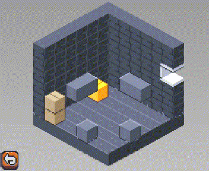
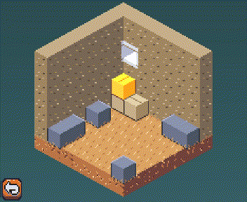
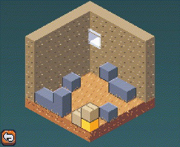

# 3D Isometric in 2D
A project implementing isometric 3D effect in a pure 2D environment, built with **Godot 3.2.x**, but I think this is not difficult to implement on other engines/frameworks once you understand how this works, so I highly encourage you to do so.

This is also a rewrite of the core mechanic for my released game [Ladder Box](https://store.steampowered.com/app/1444390):  

## Tutorial

I've also written a series of the tutorial:

| Name | Link |
|-|-|
| Project setup and basic calculation | [Link](https://www.im404.me/blog/iso3d-2d_1/)|
| Texture render order | [Link](https://im404.me/blog/iso3d-2d_2/) |
| Make blocks move | [Link](https://im404.me/blog/iso3d-2d_3) |
| Fall and jump | [Link](https://im404.me/blog/iso3d-2d_4) |
| More order and move sync | [Link](https://im404.me/blog/iso3d-2d_5) |
| Movement adjusting | [Link](https://im404.me/blog/iso3d-2d_6) |

